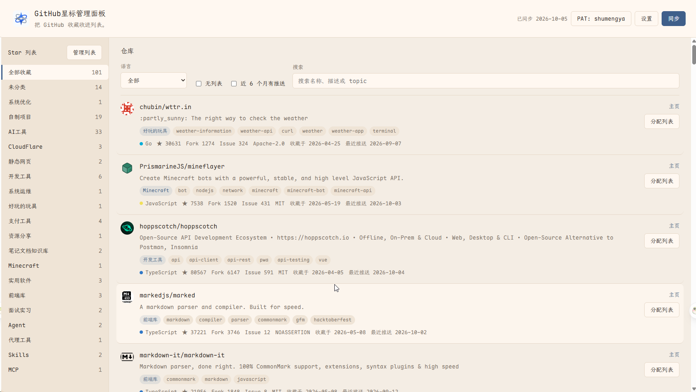

<div align="center">

# GitHub Star Manager

**A local-first web app to organize your GitHub starred repositories with Star Lists.**

[](./LICENSE)
[](https://react.dev)
[](https://vite.dev)
[](https://www.typescriptlang.org)
[](https://developers.cloudflare.com)

**[🚀 Live Demo](https://gh-star.smyhub.com/)** · [中文文档](./README.md)



[](https://deploy.workers.cloudflare.com/?url=https://github.com/shumengya/github-star-manager)

**Click the button above to deploy GitHub Star Manager to your own Cloudflare account in one click.**

</div>

---

## Why Star Manager

Once you star a few hundred repositories, GitHub's flat star list becomes hard to navigate. Star Manager gives you a fast, searchable workspace on top of GitHub's **Star Lists** feature:

- **Sync** your starred repositories and Star Lists from GitHub, with automatic staleness detection (24h) and retry for failed list scans.
- **Browse & filter** your stars by list, language, search query, ungrouped-only, or recently starred.
- **Organize** repos into lists with a couple of clicks — locally first, then write back to GitHub.
- **Manage lists** (create / rename / delete) directly in the app; changes are applied to your GitHub account.
- **Local-first**: all working data lives in your browser (IndexedDB via Dexie). Your PAT never leaves your browser except to GitHub (through a thin proxy, see below).

## How It Works

The app runs entirely in the browser and talks to the GitHub API through a same-origin proxy that avoids CORS friction:

```text
┌────────────┐   /api/github/*    ┌──────────────────────┐   https://api.github.com
│  Browser   │ ─────────────────► │  Thin proxy layer    │ ────────────────────────►  GitHub
│ (React 19) │                    │ • Dev: Vite proxy    │
└────────────┘                    │ • Prod: CF Functions │
     │  IndexedDB (Dexie)         └──────────────────────┘
     └─ repos / lists / memberships / README excerpts
```

- **Development** — the built-in Vite dev-server proxy (`vite.config.ts`) forwards `/api/github/*` to `api.github.com`.
- **Production** — either of:
  - `functions/api/github/` (Cloudflare Pages Functions)
  - `worker/index.js` + `wrangler.jsonc` (Cloudflare Workers static-assets mode, used by the one-click deploy button)

Both are logically equivalent. Your GitHub PAT is sent as an `Authorization` header by your browser and forwarded as-is; it is **not** logged or stored anywhere server-side.

## Features

- ⭐ **Star sync** — fetch starred repos + Star Lists, scan list memberships, retry failed scans individually.
- 🗂 **List workspace** — sidebar with *All starred* / *Unclassified* / your custom lists, with live counts.
- 🔍 **Filtering & search** — full-text search over repo names/descriptions, language filter, ungrouped-only and recent-only toggles.
- 📋 **README excerpts** — opt-in preview of each repo's README to help you decide where it belongs.
- ✏️ **Assign repos to lists** — multi-list assignment per repo, previewed locally before write-back.
- 🛠 **List management** — create, rename, and delete Star Lists, synced to GitHub.
- 🌐 **i18n** — English / Simplified Chinese UI with browser-language auto-detection and manual override.
- 🧹 **Cache control** — clear local cache from Settings at any time.

## One-Click Deploy to Your Cloudflare

Click the **Deploy to Cloudflare** button (top of this README):

1. Cloudflare forks this repository and runs the build (`pnpm build`) automatically.
2. You get your own instance on a `*.workers.dev` domain once the build finishes.
3. Open your own domain, paste a GitHub PAT, and start organizing.

> The deploy is driven by `wrangler.jsonc` (Workers static-assets mode): static pages are served from `dist/`, while `/api/github/*` is proxied to the GitHub API by `worker/index.js`. No extra configuration required.

## Manual Deployment

### Option A: Cloudflare Pages

| Setting | Value |
| --- | --- |
| Build command | `pnpm build` |
| Build output directory | `dist` |
| Root directory | `/` |
| Node version | 20+ (set `NODE_VERSION=20` env var if needed) |

The `functions/api/github/` directory is picked up by Cloudflare Pages automatically — no extra configuration required.

### Option B: Cloudflare Workers (wrangler)

```bash
pnpm install
npx wrangler deploy   # builds dist and deploys
```

### Local Development

**Prerequisites**: Node.js 20+, [pnpm](https://pnpm.io), and a GitHub Personal Access Token (PAT).

```bash
pnpm install
pnpm dev      # start dev server (API proxy included)
pnpm build    # type-check + production build
pnpm preview  # preview the production build locally
```

## Getting a GitHub PAT

1. Open <https://github.com/settings/tokens>.
2. **Generate new token → Generate new token (classic)**.
3. Give it a name (e.g. `star-manager`) and grant the scopes:
   - `repo` — read stars, manage lists
   - `user` — read your profile
4. Copy the token. In the app: **Settings → GitHub PAT** (or the onboarding prompt), paste, and validate.

The token is validated against the GitHub GraphQL API and stored only in your browser's localStorage.

## Usage

1. **Connect** — paste your PAT and validate it.
2. **Sync** — click *Sync* to pull your stars and lists. Data older than 24h is flagged as stale and re-synced automatically.
3. **Browse** — use the sidebar lists, search box, language filter, and toggles (ungrouped / recent) to find repos.
4. **Organize** — click a repo's *Assign* action to add/remove its lists, or open *Manage Lists* to create/rename/delete lists.
5. **Write back** — assignments are pushed to GitHub when you save them from the assign dialog.

## Project Structure

```text
functions/api/github/       # Cloudflare Pages Functions (API proxy)
worker/index.js             # Cloudflare Workers entry (one-click deploy, equivalent logic)
wrangler.jsonc              # Workers config (static assets + API proxy routes)
public/                     # Static assets (favicons, logo, legacy SW cleanup)
src/
  main.tsx                  # App entry
  app/
    App.tsx                 # Main UI shell & orchestration
    layout/                 # App shell, list sidebar, repo catalog & rows
    core/                   # Use-cases: sync, queues, write-back, purge
    services/               # GitHub REST/GraphQL clients & auth
    data/                   # Dexie DB schema & reactive queries
    store/                  # Preferences (PAT, language, readme opt-in)
    types/                  # Domain types
    ui/                     # Modals & prompts (PAT, settings, lists, assign)
    i18n/                   # EN/zh-CN resources & language detection
    styles/                 # Design tokens, controls, dialogs, fonts
```

## Data & Privacy

- App data is stored in browser **IndexedDB** (database `star-manager`); preferences (PAT, language) in **localStorage**.
- The app calls GitHub directly (through the same-origin proxy) from your browser — no third-party analytics, no telemetry.
- The proxy forwards requests verbatim; tokens are never logged or persisted server-side.
- Avoid exporting/sharing browser storage if your PAT is stored.

## Troubleshooting

| Symptom | Fix |
| --- | --- |
| `Star Lists API not available for this token/account` | Star Lists GraphQL fields may not be available for your account/token; re-check scopes or account features. |
| PAT validation failed | Check the token value/scopes; regenerate if needed. |
| Sync returns no repos | Confirm your account actually has starred repos and sync completed. |
| Some lists show a retry button | List-membership scan hit rate limits; click retry for the failed lists only. |

## Roadmap

- Incremental sync to reduce API calls.
- Smarter rate-limit handling and failure recovery.
- Clearer error attribution (permission / token / network).
- README excerpt caching policy (`ETag`/hash + truncation).
- Optional LLM-assisted classification (two-stage tagging pipeline).

## Contributing

Issues and PRs are welcome. For larger changes, please open an issue first to discuss the scope.

```bash
pnpm install
pnpm dev      # develop
pnpm build    # type-check + production build
```

## License

Released under the [AGPL-3.0 License](./LICENSE).
